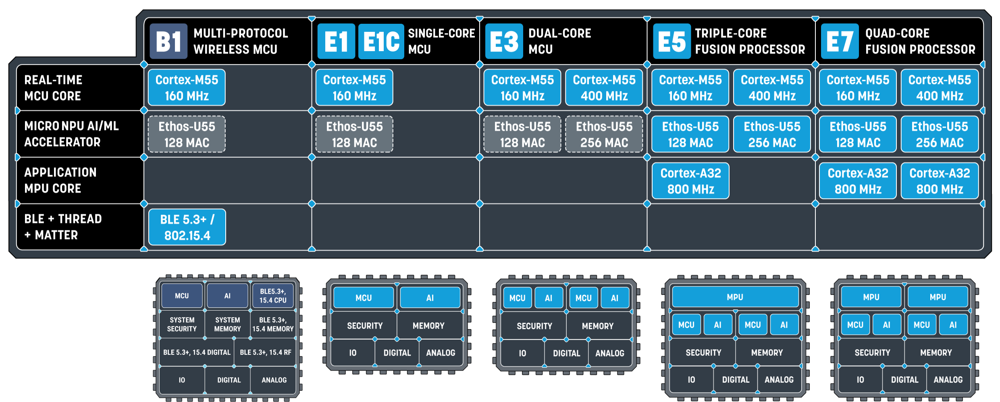

**Introduction**
================

In this user guide, we cover the following steps:

1. **Prerequisites for Building Zephyr OS:**
    - Understand the requirements for building Zephyr OS, a small Real-Time Operating System designed for connected, resource-constrained, and embedded devices for the real-time subsystems in Alif's devices.

2. **Building an Application Using the West Tool:**
    - Learn how to build an application using the West tool. West is Zephyr’s meta tool written in Python, which calls CMake/Make commands on a Linux host—such as Ubuntu.

3. **Programming the Application Binary onto ITCM:**
    - Steps to program the application binary onto the ITCM of one of the real-time subsystems and booting the application.

4. **Running the Application from MRAM:**
    - Discover how to run applications directly from MRAM. Learn about the supported targets, specific MRAM boot addresses for RTSS-HE and RTSS-HP, and the necessary build commands.

**Zephyr RTOS and Toolchain**
-----------------------------

The real-time subsystems boot with Zephyr OS, a small RTOS for connected, resource-constrained, and embedded devices. Zephyr supports multiple architectures and is available under the Apache 2.0 license.

Zephyr uses a meta-tool called `west` to execute Kconfig, CMake, and build system commands (Make or Ninja). CMake builds applications with the Zephyr kernel in two stages:

- **Configuration stage:** CMakeLists.txt build scripts are executed to generate host-native build scripts.

- **Build stage:** The generated build scripts are executed to compile the application.

**Hardware and Software Requirements**
--------------------------------------

**Hardware Requirements**
~~~~~~~~~~~~~~~~~~~~~~~~~

Ensure you have one of the following development kits to proceed with your project setup:

- Ensemble Devkit (DK-E7)
- Ensemble E1C Devkit (DK-E1C)
- Balletto Devkit (DK-B1)

**Software Requirements**
~~~~~~~~~~~~~~~~~~~~~~~~~

1. **For Host PC:**
    - Ubuntu 20.04 64-bit or later.

    *Note: While different flavors of Linux distributions may also work, they have not been thoroughly tested.*

2. **Alif Security Toolkit:**
    - Version 1.98.3 or later.

    * Available at `Alif Toolkit Download`_

**Alif MCU Families**
~~~~~~~~~~~~~~~~~~~~~

The Alif DevKit is a development board featuring an Alif multi-core SoC, offering both high-performance and low-power execution.

- **DK-E7:**
    - Features:
        - Two Cortex-M55 CPU cores
        - Two Ethos-U55 neural network processor cores
        - Two Cortex-A32 MPU cores
    - Allows configuration of the E7 MCU to operate like other Ensemble MCUs with fewer cores, enabling exploration of the E5, E3, and E1 series devices using a single kit.

- **DK-E1C:**
    - Designed to explore the Compact series of Ensemble devices.
    - Features:
        - A Cortex-M55 CPU core
        - Arm Ethos-U55 micro NPU
    - Known for its low power consumption within the Ensemble family.

- **DK-B1:**
    - Introduces the Balletto B1 series, a wireless MCU with integrated hardware acceleration for AI/ML workloads.
    - Includes:
        - Bluetooth Low Energy 5.3
        - 802.15.4 based Thread protocols
        - An Ethos-U55 microNPU for AI acceleration
        - A Cortex-M55 MCU core

**Toolchains**
~~~~~~~~~~~~~~

The following toolchains have been tested for the SDK application:

.. list-table::
   :header-rows: 1

   * - Compiler
     - Version
     - Link
   * - GCC (GNU Compiler Collection)
     - v12.2.0
     - `GCC Download`_
   * - ArmCLang
     - v6.18
     - `ArmCLang Download`_
   * - LLVM (Low-Level Virtual Machine)
     - v17.0.1
     - `LLVM Download`_

**Target Reference Board**
~~~~~~~~~~~~~~~~~~~~~~~~~~

- Alif Devkit Ensemble E3
- Alif Devkit Ensemble E7
- Alif Devkit Ensemble E1C
- Alif Devkit Balletto B1

**Software Components**
~~~~~~~~~~~~~~~~~~~~~~~

The following software components are part of the SDK:

.. list-table::
   :header-rows: 1

   * - Name
     - Path
     - Repository
   * - zephyr
     - zephyr
     - `zephyr_alif`_
   * - mcuboot_alif
     - bootloader/mcuboot
     - `mcuboot_alif`_
   * - cmsis_alif
     - modules/hal/cmsis
     - `cmsis_alif`_
   * - hal_alif
     - modules/hal/alif
     - `hal_alif`_
   * - sdk-alif
     - Alif Zephyr SDK
     - `sdk-alif`_