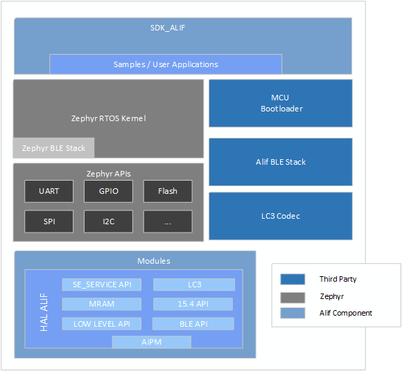
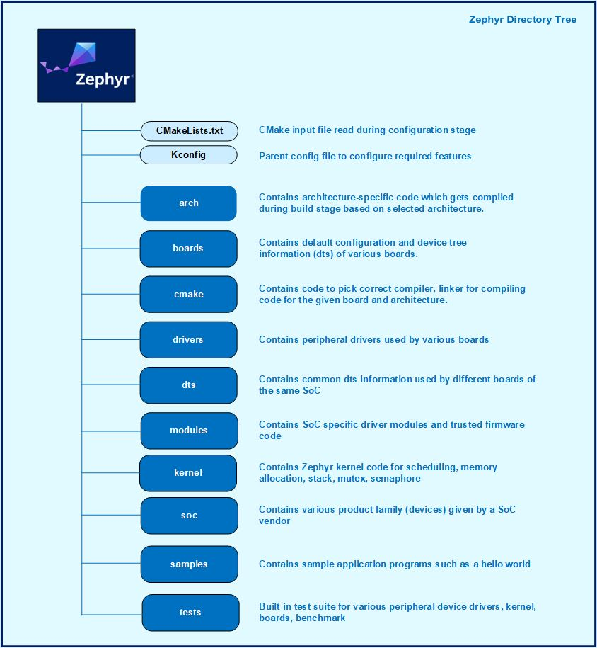

**Overview of Zephyr Alif SDK**
================================

The Zephyr Alif SDK [ZAS] is a comprehensive suite of tools that makes it possible to configure, build, and deploy applications for Alif's microcontrollers.

Repositories
------------

**Zephyr**
~~~~~~~~~~

The Zephyr repository, which is part of the SDK, takes the upstream Zephyr as a base and extends it when necessary. It includes various components that contribute to the functionality of Zephyr. These components are publicly available and open source, allowing developers from the community to contribute and collaborate.

**Alif Zephyr SDK**
~~~~~~~~~~~~~~~~~~~

Alif provides a Zephyr Software Development Kit (SDK) that combines both Alif's components and Zephyr's kernel and subsystems. By using this SDK, developers can access additional features beyond what's available in the upstream Zephyr repository. These materials may include samples, drivers, middleware protocols, and other resources that are specific to Alif. Here's what you'll find in this section:

- **Sample Applications and Tests**: We provide the latest and updated sample applications and tests specific to Alif's hardware and features. Additional custom tests can also be found here.
- **Improved APIs and Drivers**: If there are drivers with improved APIs that are not yet included in the upstream Zephyr OS, you will find them in this section.
- **Middleware Protocols and Libraries**: Alif's middleware protocols, configurations, and libraries are available here. These resources facilitate communication and interaction with Alif's hardware.
- **New Protocols and Example Applications**: Explore new protocols not currently part of Zephyr in this section. You can find example applications that demonstrate how to use these protocols effectively.
- **SDK Documentation, Binaries, and Libraries**: Access comprehensive documentation for the SDK here. You can find the necessary binaries and libraries required for developing with Alif's SDK.

Components
----------

The image below illustrates the various components of the SDK for Alif Semiconductor's products. The main components include SDK Alif, Zephyr RTOS, HAL Alif, and the MCUboot bootloader.

   *SDK Components*

The SDK offers a comprehensive suite of components to enhance software development:

.. list-table::
   :widths: 25 75
   :header-rows: 1

   * - **Component**
     - **Description**
   * - **Zephyr RTOS**
     - The Zephyr Project is an open-source, scalable real-time operating system for IoT devices.
   * - **SoC/Board Files/DTS**
     - Configuration files for system-on-chip (SoC) and board-specific settings.
   * - **Zephyr Device Driver**
     - Zephyr's drivers for interfacing with hardware peripherals.
   * - **SDK_ALIF**
     - Alif-specific applications and examples, tailored for their hardware.
   * - **Third-Party Licensed**
     - Integration of third-party tools and libraries, in source and binary forms.
   * - **Alif BLE Stack**
     - Implementation of Bluetooth Low Energy stack for wireless communication.
   * - **LC3 Audio Codec**
     - Low Complexity Communication Codec for high-quality, low bitrate audio.
   * - **MCU Boot**
     - Secure bootloader for 32-bit MCUs, provides secure booting and firmware updates, enhancing security and reliability.

**HAL_ALIF (Hardware Abstraction Layer)**
~~~~~~~~~~~~~~~~~~~~~~~~~~~~~~~~~~~~~~~~~

The HAL provides hardware-specific APIs for Alif's devices, enabling consistent software interaction:

1. **SE Services (Security Services)**: Alif's security services, including encryption, authentication, and secure communication.
2. **Alif Crypto Libraries**: Alif’s Crypto libraries provide support for MbedTLS.
3. **Power Management API**: APIs related to power management, optimizing energy usage in Alif devices.
4. **BLE API**:
   - APIs for Bluetooth Low Energy functionality, facilitating interactions for BLE stack operations.
5. **LC3 API**:
   - Application Programming Interface for the LC3 (Low Complexity Communication Codec) audio codec, enhancing audio processing capabilities.
6. **15.4 API**:
   - IEEE 802.15.4 support for protocols like OpenThread and Matter, leveraging the same radio used by BLE but with distinct modulation and protocol implementations.

These APIs within the HAL_ALIF framework ensure that developers can access the underlying hardware features in a standardized manner, simplifying development across Alif's product range.

**Documentation**
~~~~~~~~~~~~~~~~~

- **Getting Started Guide**: Step-by-step instructions for initial setup.
- **Release Notes**: Changelog and update information.
- **Licenses**: Licensing terms for SDK components.
- **README**: Comprehensive project overview.

Toolchains
----------

SDK supports the following development toolchains:

- **GCC (GNU Compiler Collection v12.2.0)** - Used through the Zephyr Project.
- **LLVM-embedded-toolchain-for-Arm 17.0.1** - For optimized Arm code generation.
- **ARM CLang 6.18** - For Arm-specific optimizations.

**Zephyr RTOS**
---------------

Zephyr is designed for resource-constrained and embedded systems, offering:

- Small, efficient kernel.
- Highly modular and configurable architecture.
- Support for multiple architectures.
- Devicetree for hardware abstraction.
- Optimized driver model.
- Includes protocol stacks like BLE, 802.15.4, IPv4/IPv6, and others.
- File system support with LittleFS and FATFS.

The following directory structure represents the Zephyr project:

   *SDK Directory Tree*

This structure organizes Zephyr's components for easy navigation and integration with additional APIs like the LC3 Audio Codec, BLE API, LC3 API, and 15.4 API when and where required.
